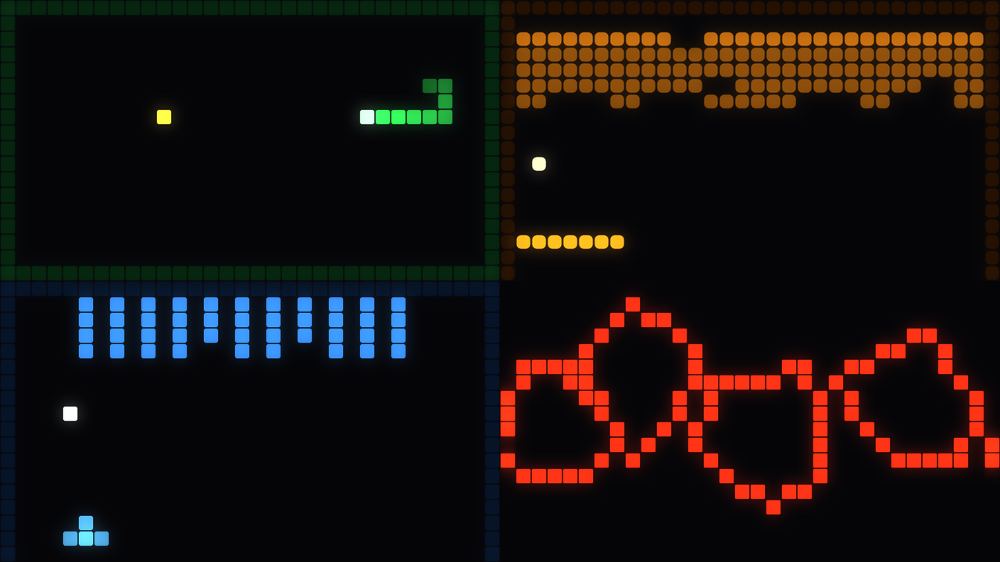
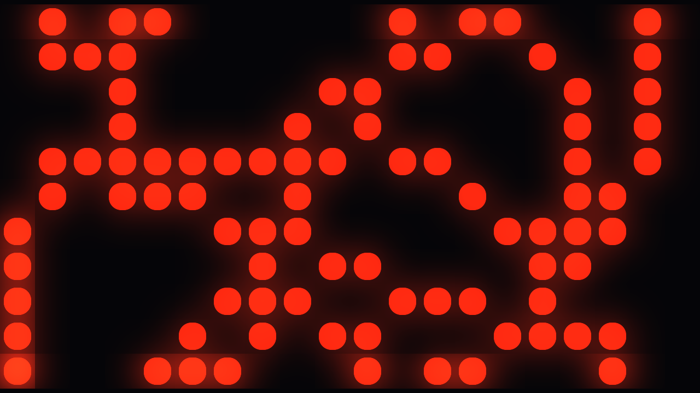

# Coinop

> **AI-assisted project.** This codebase was created with [Claude](https://claude.com/claude-code)
> (Anthropic), directed and reviewed by a human author. The games are verified
> by an offline harness that drives the real game classes with no graphics API
> present and asserts on simulation state — that the snake is a given length,
> that the ball's vertical component never collapses, that a match ends — and a
> second harness compiles the shaders in a headless GL context and measures what
> they draw (see [Status](#status)). It has **never been loaded into Resolume**.
> Check it in your own rig before trusting it in a show.

Fourteen playable arcade games for [Resolume](https://resolume.com) Arena and
Avenue, as a pair of FFGL plugins. Driven by MIDI or OSC, or left to play
themselves.

**Video:** [The eight games v0.2.0 added, in 58 seconds](https://www.youtube.com/watch?v=SNqhfKOn-xs)
 · [the original five, from v0.1.0](https://www.youtube.com/watch?v=DZyiCXpSt98)



<sub>Four of the fourteen, on four of the six palettes — Chase on Amber, Trails
on Ice, Stacker on Candy, Girders on Fire. Rendered by `coinopgl`, the offline
harness: the real autopilot playing through the real cell shader, not a Resolume
screen capture.</sub>

| Game | What it is |
| --- | --- |
| **Snake** | Grows, turns, traps itself. Two buttons or four. |
| **Bricks** | Ball, paddle, brick field. Best played with a fader. |
| **Marchers** | A formation that steps down the screen and shoots back. |
| **Rally** | Two paddles, one ball. Two players, one plugin instance. |
| **Drift** | Rotating ship, splitting rocks, wrapping playfield. |
| **Stacker** | Falling polyominoes. Contiguous runs clear, not full rows. |
| **Chase** | A maze carved fresh each level, pellets, four pursuers. |
| **Girders** | Climb the floors while the hazards cascade back down them. |
| **Swarm** | A formation attackers peel out of, dive from, and rejoin. |
| **Trails** | Riders that never stop, leaving walls. Last one alive. |
| **Reflex** | A prompt, a closing window, and the right button or nothing. |
| **Rafters** | Hit the floor from below to flip what is standing on it. |
| **Duel** | Two fighters. Wind-up, active, recovery. Best of three. |
| **Flapper** | One button against gravity, through the gaps in a moving wall. |

The mechanics are the public domain part; the names are not. None of these is
named after what it descends from, and none of them copies the parts a court
has held to be protected expression — see
[AGENTS.md](AGENTS.md#naming-and-the-line-the-games-are-written-to) for the rule
and [`source/games/Stacker.h`](source/games/Stacker.h) for it applied in
detail.

`Coinop` is a source. `Coinop Over` is an effect — and in the effect, the brick
field can be built out of the incoming clip, so breaking a brick punches a hole
through to the layer below.

## Why it exists

Two jobs, and most of the design follows from the second:

- **A generator that is genuinely never the same twice.** A seeded game that
  plays itself, resets when it loses, and has an intensity that climbs through a
  run and drops when it restarts.
- **Pixel mapping.** The composition *is* the fixture layout, Resolume's pixel
  mapper samples it, and the playfield is what the lights do. That is why
  everything is drawn as cells, why the grid size is a parameter, and why even
  the vector game is rasterised.



<sub>The same Drift, with the grid coarsened to nineteen cells and the gaps
opened. This is the shape the plugin takes when a pixel mapper is sampling it —
and the reason the vector game is drawn as cells at all. A hairline vector lands
between fixtures and disappears.</sub>

## Controls

FFGL has no keyboard and no gamepad — it has parameters, and Resolume will MIDI-
or OSC-map any of them. So every control is a parameter:

| Parameter | Good for |
| --- | --- |
| **Paddle** | A fader or an OSC float. The nicest way to play Bricks and Rally. |
| **Left / Right / Up / Down** | Four pads. Steering, Rally's second player, Stacker's rotate, Duel's block. |
| **Fire** | One pad. Shoot, launch, thrust, hard-drop, strike — and in Snake, "turn right". |
| **Autoplay** | On by default. The autopilot plays, and loses on purpose. |
| **Skill** | How competent the autopilot is. At 1.0 it plays a long game. |
| **Seed** | Same seed, same game. |

<!-- downloads:start -->

## Download

**[v0.2.0](https://github.com/stoatworks-labs/coinop/releases/tag/v0.2.0)** — prebuilt for macOS and Windows. Pick your platform:

<details>
<summary><b>macOS</b> — Universal (Apple Silicon + Intel)</summary>

| Build | Download | Size |
| --- | --- | --- |
| Universal (Apple Silicon + Intel) · .dmg disk image | [`coinop-0.2.0-macos-universal.dmg`](https://github.com/stoatworks-labs/coinop/releases/download/v0.2.0/coinop-0.2.0-macos-universal.dmg) | 989 KB |
| Universal (Apple Silicon + Intel) · .zip archive | [`coinop-macos-universal.zip`](https://github.com/stoatworks-labs/coinop/releases/latest/download/coinop-macos-universal.zip) | 625 KB |

</details>

<details>
<summary><b>Windows</b> — x64</summary>

| Build | Download | Size |
| --- | --- | --- |
| x64 · .exe installer | [`coinop-0.2.0-windows-x86_64-setup.exe`](https://github.com/stoatworks-labs/coinop/releases/download/v0.2.0/coinop-0.2.0-windows-x86_64-setup.exe) | 262 KB |
| x64 · .zip archive | [`coinop-windows-x86_64.zip`](https://github.com/stoatworks-labs/coinop/releases/latest/download/coinop-windows-x86_64.zip) | 324 KB |

</details>

All builds, checksums and release notes: [github.com/stoatworks-labs/coinop/releases](https://github.com/stoatworks-labs/coinop/releases).

macOS builds are signed and notarised and open normally. The Windows builds are unsigned, so SmartScreen warns once.

<!-- downloads:end -->

## Build from source

```bash
git clone --recursive https://github.com/stoatworks-labs/coinop
```

```bash
cmake -S . -B build -DCMAKE_BUILD_TYPE=Release && cmake --build build -j8
```

```bash
cmake --install build
```

See [CLAUDE.md](CLAUDE.md) for the full command reference and
[AGENTS.md](AGENTS.md) for why the code is shaped the way it is.

## Status

Verified offline on macOS, in two harnesses:

- **`coinoptest`** — 243 checks, no GL context. Per-game determinism, the three
  host-timing defences, and the invariants that matter per game: Snake's turn
  queue, Bricks' tunnelling and its two degenerate-angle locks, Rally's
  termination, Marchers' bounds, Drift's wrapping, Stacker's clear rule,
  Chase's maze loops and its reversal ban, Girders' floor ordering, Swarm's
  divers rejoining, Trails' head-on symmetry, Reflex's closing window,
  Rafters' one-cell collision, Duel's round limit, Flapper's swept collision
  and its difficulty ramp.
- **`coinopgl`** — 31 checks, headless CGL. Both shader variants compile and
  link, all fourteen games render lit cells, the letterbox lands exactly where
  it should, no GL error.

- **`demo/tools/check_sim.mjs`** — the browser demo re-implements all fourteen
  games in JavaScript, and `coinoptest --grid` reduces each one to a digest of
  its playfield after a fixed run. All fourteen agree byte for byte.

Not verified: the plugin has never been loaded into Resolume, the FFGL parameter
and clock plumbing is the part no harness here reaches, and the Windows build
has never been compiled.

<!-- attributions:start -->
This project is built on other people's work — see [ATTRIBUTIONS.md](ATTRIBUTIONS.md).
<!-- attributions:end -->

## Licence

MIT. See [LICENSE](LICENSE).

The mechanics here are generic; the names are deliberately not the famous ones,
and neither is the expression — the playfield is whatever the Grid parameter
says, colour comes from the palette by role, and the features a court has
specifically named as protected are left out. See the naming note in
[AGENTS.md](AGENTS.md).
